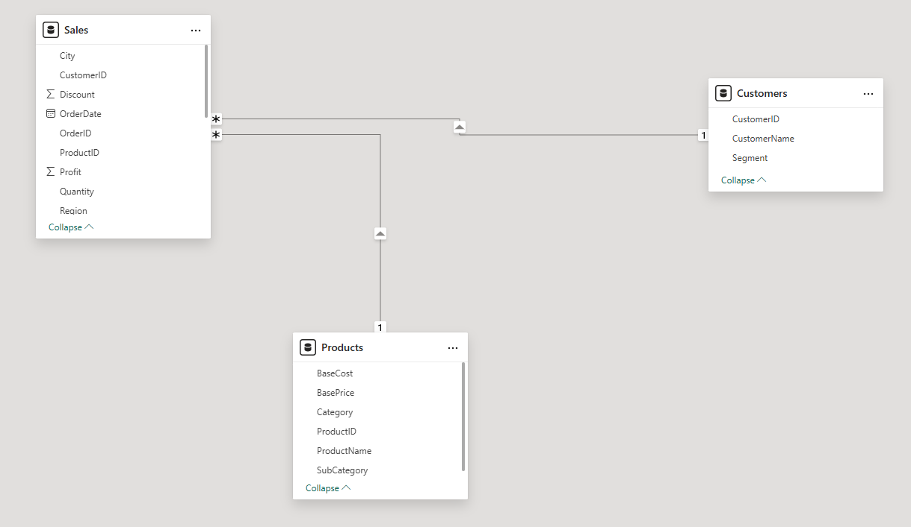
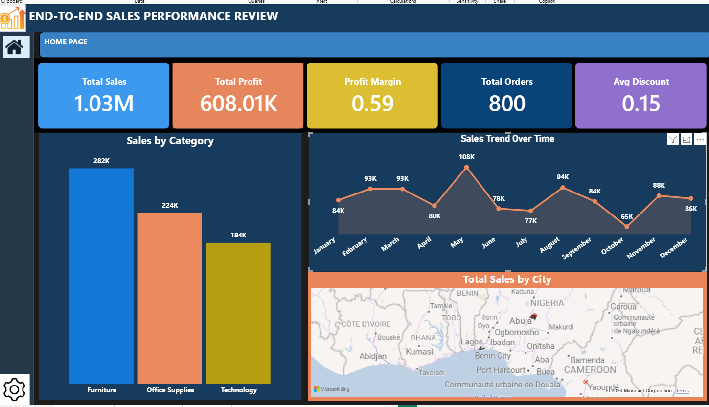
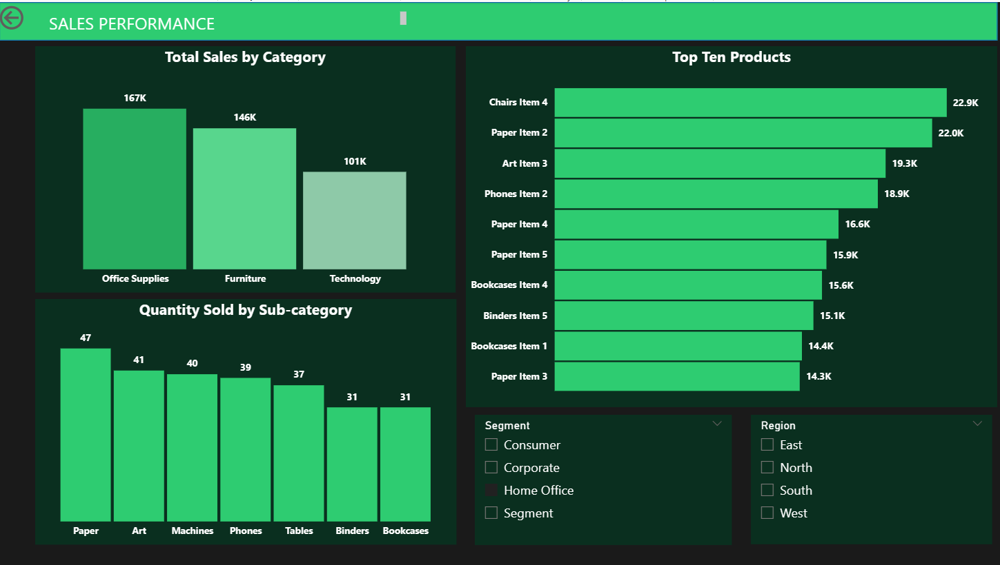
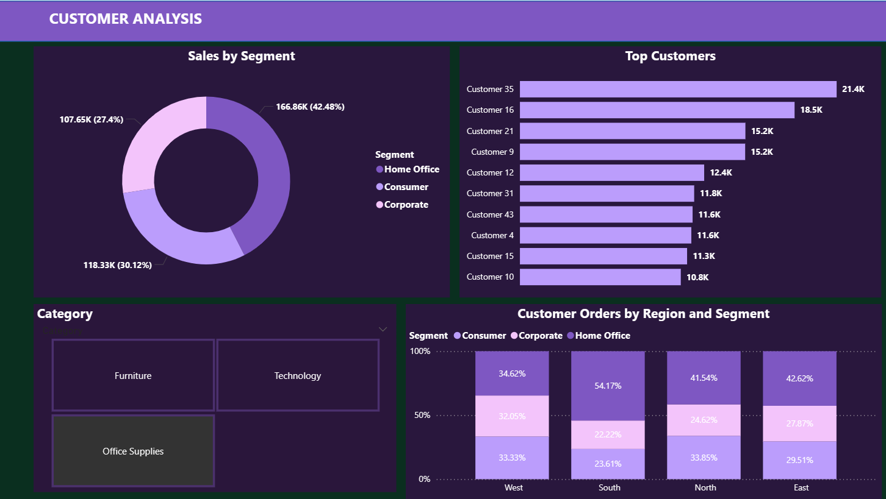
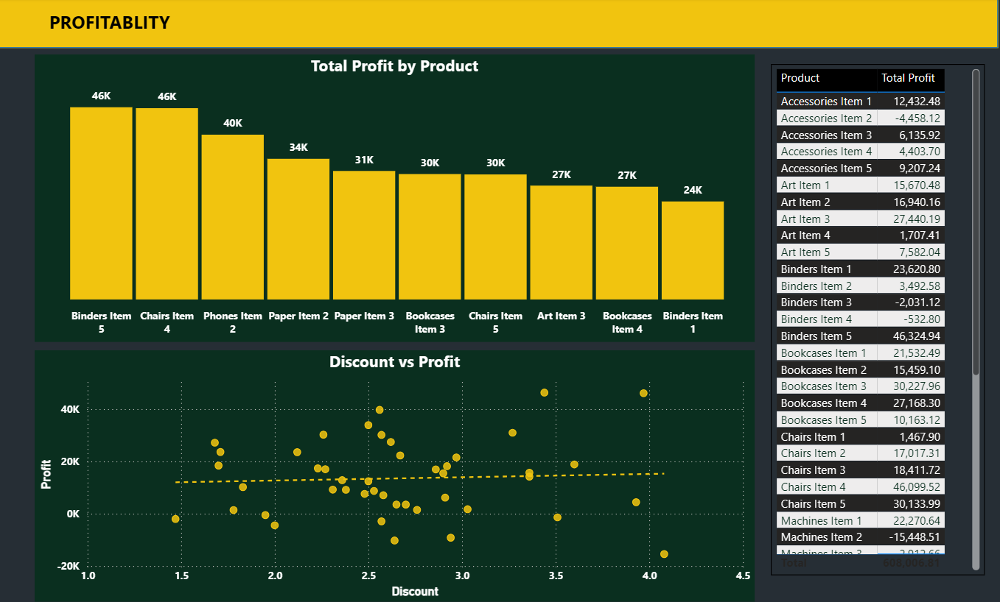

# 🛒 Retail Sales Performance & Profitability Analysis (Power BI)

## 📌 Project Overview

This project analyzes retail sales data using Power BI to uncover insights into sales performance, profitability, and customer behavior.

The goal is to transform raw transactional data into actionable insights that support strategic business decision-making.

---

## 📊 Problem Statement

Despite having large volumes of transactional data, the retail company struggles to:

* Track overall performance
* Identify profitable products and regions
* Understand discount impact on profit
* Analyze customer purchasing behavior

---

## 🎯 Objectives

* Monitor sales performance
* Evaluate profitability
* Segment customers for better targeting
* Provide data-driven recommendations

---

## 🗂️ Dataset Description

### 🔹 Sales Data

* Order ID
* Order Date
* Sales Amount
* Profit
* Discount
* Quantity
* Region
* City

### 🔹 Customer Data

* Customer ID
* Customer Segment (Consumer, Corporate, Home Office)

### 🔹 Product Data

* Product ID
* Product Name
* Category
* Sub-category

---

## 📈 Key Performance Indicators (KPIs)

### Sales Metrics

* Total Sales
* Total Profit
* Profit Margin
* Total Orders
* Average Order Value (AOV)
* Sales by Region
* Sales by Category

### Profitability Metrics

* Profit by Product
* Loss-making Products
* Discount Impact on Profit

### Customer Metrics

* Top Customers
* Sales by Segment

---

## 🧠 Data Modeling

Relationships established:

* Sales → Customers (CustomerID)
* Sales → Products (ProductID)
* Sales → Date Table (OrderDate)

---

## 🛠️ Tools & Technologies

* Power BI
* Power Query
* DAX (Data Analysis Expressions)

---

## 📊 Dashboard Pages

### 1. Executive Dashboard

* Overview of KPIs (Sales, Profit, Orders)
* Sales trends over time
* Regional performance

### 2. Sales Performance

* Top products and categories
* Sales distribution
* Quantity analysis

### 3. Profitability Analysis

* Loss-making products
* Discount vs Profit relationship
* Profit contribution by product

### 4. Customer Insights

* Customer segmentation
* High-value customers
* Segment performance

---

## 🔍 Key Insights

### Sales Performance

* Technology category generates highest revenue
* Sales fluctuate monthly (seasonality present)
* Some regions have high sales but low profit

### Profitability

* High discounts reduce profit margins
* Some products consistently operate at a loss
* High sales ≠ high profit

### Customer Behavior

* Corporate customers have higher AOV
* Few customers drive most revenue (Pareto effect)
* Repeat customers are highly valuable

---

## 💡 Recommendations

### Business Strategy

* Optimize discount strategy
* Focus on high-margin products

### Regional Strategy

* Improve underperforming regions
* Replicate successful strategies

### Customer Strategy

* Introduce loyalty programs
* Target corporate clients

### Operational Strategy

* Align marketing with seasonal trends
* Monitor monthly performance

---

## 📁 Project Files

* `Retail_Sales.pbix` → Power BI dashboard
* `dataset.csv` → Raw dataset
* `images/` → Dashboard screenshots

---

## 🚀 How to Use

1. Download the `.pbix` file
2. Open in Power BI Desktop
3. Explore dashboards and insights

---

## 🤝 Let's Connect

If you found this project helpful, feel free to connect, give feedback, or collaborate!

---
